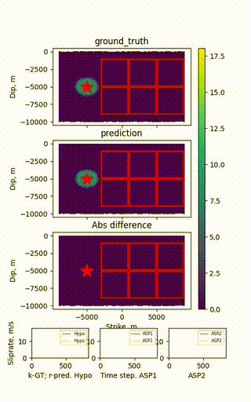

# EQGNS: Earthquake rupture dynamics from Graph Neural Networks

[](https://doi.org/10.1029/2025JB031981)
[](https://doi.org/10.5281/zenodo.17095311)
[](LICENSE)

EQGNS is a Graph Network-based Simulator (GNS) for 2D earthquake dynamic rupture. It is the code behind:

> Liu, D., & Becker, T. W. (2025). Earthquake rupture dynamics from graph neural networks. *Journal of Geophysical Research: Solid Earth*, 130. https://doi.org/10.1029/2025JB031981

This repository is a fork of [geoelements/gns](https://github.com/geoelements/gns.git). Modifications are made to MeshNet, the mesh-based GNN surrogate, and include:

 1. A parameter configuration system (`config.json` under the model path; see `meshnet/example.config.json`).
 2. A preprocessing pipeline to convert earthquake dynamic rupture states computed by [EQdyna](https://github.com/EQDYNA/EQdyna.git) to trajectories recognizable to the GNS (`scripts/utils/prepare.eqdyna.4gns.py`, `scripts/utils/prepare.fractal.stress.eqdyna.4gns.py`).
 3. A `node_property` channel carrying scalar initial-stress conditions per node, and an extra node type for high-stress asperities.
 4. Postprocessing rendering and analysis of earthquake rupture dynamics (`meshnet/render.py`, `scripts/utils/plot.rupture.dynamics.py`).
 5. Batch and scenario-sweep rollout drivers with cached graph construction for faster inference (`meshnet/batch_rollout.py`, `scripts/scenario.rollout.py`).

<p align="left">
 
</p>

> GNS prediction of multi-asperity prestress rupture at 3 million trained steps.

## How to cite

If you use EQGNS, please cite the paper and the archived software:

- Liu, D., & Becker, T. W. (2025). Earthquake rupture dynamics from graph neural networks. *Journal of Geophysical Research: Solid Earth*, 130. https://doi.org/10.1029/2025JB031981
- Liu, D., & Becker, T. W. (2025). Source code and dataset for research article "Earthquake rupture dynamics from Graph Neural Networks". Zenodo. https://doi.org/10.5281/zenodo.17095311

Please also cite the upstream GNS framework this work builds on, and the methods it follows:

- Kumar, K., & Vantassel, J. (2023). GNS: A generalizable Graph Neural Network-based simulator for particulate and fluid modeling. *Journal of Open Source Software*, 8(88), 5025. https://doi.org/10.21105/joss.05025
- The MeshNet architecture follows MeshGraphNets ([Pfaff et al., 2021](https://arxiv.org/abs/2010.03409)); the GNS approach follows [Sanchez-Gonzalez et al., 2020](https://arxiv.org/abs/2002.09405).

A machine-readable citation is in [CITATION.cff](CITATION.cff). License: MIT (see [LICENSE](LICENSE)).

## Installation

No conda: one `requirements.txt`, every direct dependency version-pinned.

```shell
python3 -m venv venv
source venv/bin/activate
pip install --upgrade pip

# CUDA wheels of torch/PyG are multi-GB; use the CPU index explicitly if
# you don't have a GPU (swap in a CUDA index/wheel page otherwise):
pip install torch==2.6.0 --index-url https://download.pytorch.org/whl/cpu
pip install torch_geometric==2.6.1
pip install torch_scatter==2.1.2 torch_sparse==0.6.18 torch_cluster==1.6.3 \
  -f https://data.pyg.org/whl/torch-2.6.0+cpu.html

pip install -r requirements.txt
```

For a CUDA build on a local server or TACC Frontera (validated stack:
torch 2.6.0+cu124), use `scripts/build_venv.sh` / `scripts/build_venv_frontera.sh`
instead, then `source scripts/start_venv.sh` to activate.

## Quickstart

No external dataset needed — the fast test tier trains and rolls out a tiny
synthetic mesh end to end:

```shell
pytest tests/ -m "not slow" -q
```

Expected output: no `FAILED` lines, ending in `N passed` (a few
`skipped`/`deselected` are expected — see `tests/README.md` for the tier
breakdown). Run on a venv built fresh from the Installation step above, not
one copied or moved after creation — a moved venv's compiled
`torch_cluster`/`torch_sparse` extensions silently fail to load.

For the real EQGNS pipeline (EQdyna data -> train -> rollout -> render) see
the user guide:

1. [Data preparation](docs/user/data_preparation.md) — convert EQdyna output to GNS trajectories.
2. [Training](docs/user/training.md) — direct, single-run, and sweep entry points; `config.json`.
3. [Rollout and analysis](docs/user/rollout_and_analysis.md) — single and batched inference.
4. [Batched rollout](docs/user/ROLLOUT_BATCHING.md).
5. [Inverse problem example](docs/user/example-1.md).

## Reproducing the paper

- The exact code and dataset archived at publication are on Zenodo: https://doi.org/10.5281/zenodo.17095311
- `meshnet/train.py.published` is a snapshot of `meshnet/train.py` as used for the paper; the current `meshnet/train.py` adds inference-speed optimizations that are mathematically equivalent (see "Rollout speed: measurements and lessons" in `docs/user/rollout_and_analysis.md`).
- `requirements.txt` is the single, pinned environment manifest; `scripts/build_venv.sh` / `scripts/build_venv_frontera.sh` build venvs on local servers and TACC Frontera respectively.
