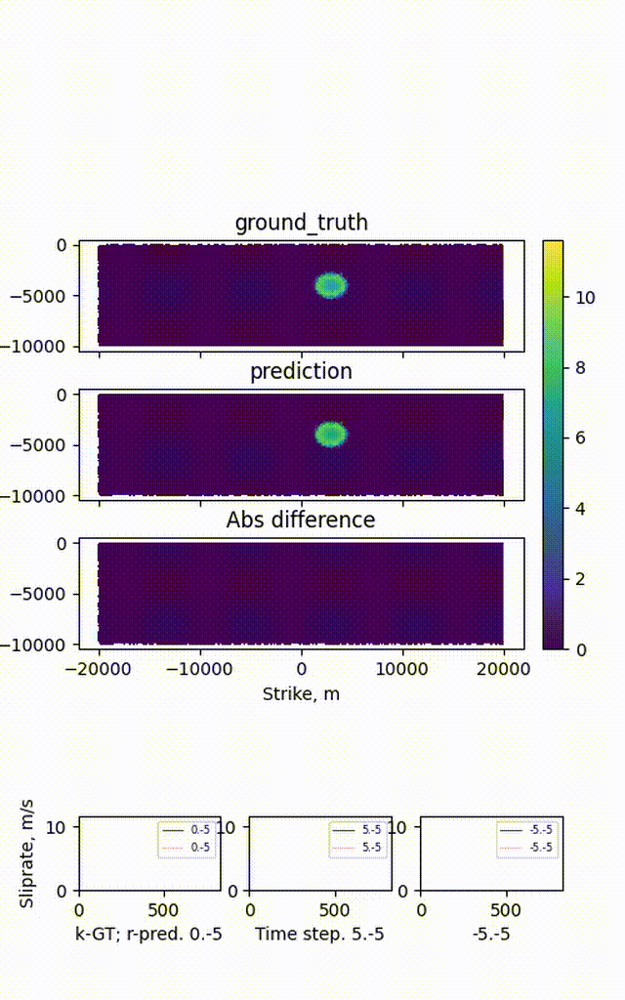

# Rollout and analysis

## Single rollout

```shell
python3 -m meshnet.train --mode=rollout \
  --data_path=<working_dir>/dataset/ \
  --model_path=<working_dir>/models.<suffix>/ \
  --output_path=<working_dir>/rollouts.<suffix>/ \
  --model_file=model-3000000.pt --train_state_file=train_state-3000000.pt
```

The rollout in `meshnet/train.py` caches the graph topology and edge features
across timesteps, roughly doubling inference speed relative to the published
version (`meshnet/train.py.published`); results are mathematically identical.
See `CLAUDE.md` for the full list of optimizations and options
(`compute_loss`, `disable_tqdm`, `use_compile`, `use_amp`).

<p align="left">
  
</p>

> GNS prediction of rupture dynamics for a 40 km long fault after 3 million
> training steps, evaluating the model's inductive generalization to fault
> lengths beyond those seen in training.

## Sweeps over models and checkpoints: `scripts/scenario.rollout.py`

`scripts/scenario.rollout.py` drives rollouts across many trained models. Edit the
`case` selector and the `model_suffixes` dict (working_dir → list of model
suffixes), set `model_id` (checkpoint step) and `gpu_id`, then:

```shell
python3 scripts/scenario.rollout.py
```

By default it shells out to `scripts/run.process.gns.py --mode rollout` per model.
Set `use_batch_rollout = True` to route through the batched engine instead.

## Batched inference: `meshnet/batch_rollout.py`

Processes multiple trajectories/models per GPU pass:

```shell
python3 meshnet/batch_rollout.py --mode=rollout \
  --working_dir <working_dir> \
  --model_suffix <suffix>[,<suffix2>,...] \
  --model_ids 3000000 --gpu_id 0 --batch_size 4
```

Optional: `--data_path` (defaults to `<working_dir>/dataset/`), `--pkl_path`
to re-process existing rollout pickles, `--output_path` (defaults to
`<working_dir>/rollouts.<suffix>/<model_file>/`).

## Fast opt-in rollout: `--rollout_fast`

`--rollout_fast {off,fp32,tf32,fp16,bf16}` (default `off`) routes the rollout through
`meshnet/fast_rollout.py` instead of the default `predict_velocity` loop: normalizers,
one-hot and the edge encoder are folded into constants, the edge MLP's first layer is
factorized per node, and the step is `torch.compile`d and CUDA-graph captured. Needs
`INPUT_SEQUENCE_LENGTH == 1`. On the 2D paper models (~4.7k nodes, 826 steps, idle GPU),
it is about 5x faster than eager fp32 (~1.8-1.9 ms/step/trajectory vs ~8-10 ms).

```shell
python3 -m meshnet.train --mode=rollout --rollout_fast=tf32 \
  --data_path=<working_dir>/dataset/ --model_path=<working_dir>/models.<suffix>/ \
  --output_path=<working_dir>/rollouts.<suffix>/ \
  --model_file=model-3000000.pt --train_state_file=train_state-3000000.pt
```

**Use `tf32`.** Gated against the full M1_D1/M2_D3/M3_D3 test sets
(`tests/paper_parity/gate.py fast`, see `tests/paper_parity/README.md` for the full
results table): `fp32` and `tf32` pass on every case within the eager run-to-run noise
floor; `fp16` and `bf16` do not (`fp16` misses on M2_D3 slip-rate MSE; `bf16` misses on
M2_D3 and M3_D3 rupture-time RMSE). The default rollout path (`--rollout_fast=off`) is
unaffected and stays the one gated by `gate.py run`.

## Rollout speed: measurements and lessons

Two measurements: a 3D mesh (below) and the 2D paper models (below), which
led to the opt-in `--rollout_fast` path (`meshnet/fast_rollout.py`,
documented above).

### 3D mesh

Measured 2026-10-08 with this repo's `meshnet` rollout (`predict_velocity` in
a loop over a static graph, batched disjoint graph as in `rollout_batched`):
3D mesh, ~30k nodes / ~130k edges per trajectory, 10 message-passing layers,
latent 128, 1726 rollout steps, one idle A100 40 GB, torch 2.9.1. Batch of 5
trajectories.

| variant | ms / step / trajectory | vs eager |
|---|---|---|
| eager fp32 (current `rollout_batched`) | 38.2 | 1x |
| `torch.compile` on `EncodeProcessDecode.forward`, fp32 | 27.0 | 1.4x |
| same, TF32 matmuls | 13.4 | 2.9x |
| same, bf16 `torch.autocast` | 9.0 | 4.2x |
| bf16 + `mode="reduce-overhead"` (CUDA graphs) | 8.9 | no extra gain |

Batch of 1 vs 5: 40.8 vs 38.2 ms per trajectory-step. At this graph size one
trajectory already saturates the GPU, so batching buys little; it matters
for small graphs (e.g. the 2D M1-M3 cases below).

**Lessons**

1. **The win is precision, not graph capture.** Compile alone is 1.4x; bf16 under compile is the
   4x. CUDA graphs add nothing once kernels are large (they help only when launch overhead
   dominates, i.e. small graphs).
2. **Pointwise parity is not a usable gate for any of these.** The rollout is autoregressive and
   amplifies rounding: even fp32 compile (kernel fusion only) differs from eager by ~4% of the
   field maximum after 200 steps; TF32/bf16 by ~30%. Gate on outcome metrics over full rollouts
   (rupture-time error, arrest/propagation classification), per model, never on bitwise match.
   Consistent with the cycle-GNS note in the `rollout-compile-optin` row (run-to-run diffs ~0.056).
3. **Never mix precisions inside one comparison.** Score every checkpoint being compared with
   the same variant; confirm a final winner in fp32.
4. **A speed check needs one or two trajectories and a few minutes.** Time ~200 steps after a
   5-step warm-up (compile costs ~11 s once per graph shape), with `torch.cuda.synchronize()`
   around the timed loop. Full-split rollouts are for the accuracy gate, not for timing.
5. **The static graph is already built once per rollout.** The edge encoder still re-runs on the
   unchanged edge features every step; caching its output is a small further saving (1 of 11
   edge MLP passes).
6. **No production edit needed to use it.** A launcher that wraps
   `gns.graph_network.EncodeProcessDecode.forward` in `torch.compile` + `torch.autocast(bf16)` and
   then `runpy.run_module("meshnet.train")` leaves `meshnet/` and checkpoints untouched (rule 1),
   so it stays opt-in and out of the paper-parity gate.

### 2D paper models

Measured 2026-10-08 on the M1-M3 checkpoints (`tests/paper_parity/gate.py` CASES): ~4.7k nodes /
~28k edges per trajectory, 826 steps, one idle A100 (GPU 1), torch 2.9.1.

`--rollout_fast {fp32,tf32,fp16,bf16}` (default `off`) runs `meshnet/fast_rollout.py`: same math
as `predict_velocity` on the static graph, with normalizers, one-hot and the edge encoder folded
into constants, the edge MLP's first layer factorized per node, edges laid out as (node, in-degree
slot) so aggregation is a fixed-order masked sum (no scatter, deterministic), `torch.compile`, and
the whole step captured as one CUDA graph.

ms / step / trajectory (min of 3 x 200 steps; the factorized path with `index_add_`
aggregation; the slot layout replaced it after these timings and is not yet timed):

| variant | batch 1 | batch 6 (M1_D1) | batch 15 (M2_D3) |
|---|---|---|---|
| eager fp32 (default path) | 10.1 | 8.06 | 7.77 |
| eager TF32 | 6.4 | 4.32 | 4.23 |
| fast tf32 | 1.88 | 1.87 | 1.86 |
| fast fp16 | 1.83 | | |
| fast bf16 | 1.81 | 1.46 | 1.37 |

So ~5.4x (tf32) to ~5.5x (fp16, batch 1) over eager; most of it is the CUDA graph plus compile,
which on these small graphs removes launch overhead that dominates (unlike the 3D case above).
Once graphed, batching adds little. `max-autotune` compile gains a further ~15% at a ~30 s
warm-up per graph shape; not exposed.

Accuracy, full test sets (outcome metrics, `gate.metrics`), against the deterministic
`reference.json` and two nondeterministic eager runs (the noise floor): mean rt_rmse per case

| case | reference | eager runs | fast fp32 | fast tf32 | fast fp16 | fast bf16 |
|---|---|---|---|---|---|---|
| M1_D1 | 0.352 | 0.352, 0.352 | 0.352 | 0.347 | 0.343 | 0.339 |
| M2_D3 | 0.341 | 0.331, 0.337 | 0.326 | 0.304 | 0.318 | **0.398** |
| M3_D3 | 0.272 | 0.272, 0.272 | 0.272 | 0.274 | 0.274 | **0.287** |

The table above is a pointwise rt_rmse spot-check (small sample), superseded by the full-test-set
deterministic gate. **Use `--rollout_fast tf32`** (fp32 also passes; fp16 and bf16 fail the gate
on at least one case) — see "Fast opt-in rollout" above for the recommendation and
`tests/paper_parity/README.md` for the full per-case gate results and `gate.py fast` usage.

## Batched rollout: `--rollout_batch_size`

`--rollout_batch_size B` (default 1) rolls out B same-length test trajectories as one
disjoint graph (`meshnet/train.py:rollout_batched`).
- **Default B=1:** the original path, bit-identical. The paper-parity gate runs on it.
- **B>1:** the same math per trajectory, meant for evaluation throughput, not for gating.

Measured 2026-10-01, published M1 (3M), 6 M1 test trajectories, deterministic mode,
B=1 vs B=6:

| Quantity | Result |
|---|---|
| Step-0 difference (relative) | ~5e-8. Float32 rounding: larger matrices select different cuBLAS kernels, so sums run in a different order. |
| Growth during active rupture | ~10^5 by step 300; peak 0.44 (traj 2) and 0.21 (traj 4). Decays to ~1e-9 after arrest. |
| Gate metrics, B=6 vs B=1 | 4/6 trajectories within 1e-4; traj 2 differs 1e-3 and traj 4 3% (mse_vx). B>1 cannot pass the 1e-4 gate. |
| Rupture time | Max shift 0.017 s (traj 2) and 0.067 s (traj 4); mean ~1e-4 s; the same nodes rupture. |
| Rupture-time contours (1 s) | Visually identical (`figs/rollout_batched_vs_single_rupture_time.png`). |
| On-fault stations (paper's 6) | Traj 2 identical; traj 4's main pulse identical, a late second pulse differs (e.g. 3.5 vs 4.3 m/s) — EQdyna has no such pulse, traj 4 arrests early and both GNS versions spuriously re-rupture (`figs/rollout_batched_vs_single_stations.png`). |

What it means: the GNS amplifies rounding-size perturbations by 10^5-10^7 during active
rupture (likely the same mechanism behind the ~30x seed spread of the M1 retrain at
500k, where training losses matched to <2x); the divergence concentrates where the model
is already wrong (spurious re-rupture in arrest cases); pointwise slip-rate MSE is
fragile, prefer rupture time and arrest outcome for model comparison. Figures use the
existing helpers in `scripts/utils/plot.rupture.dynamics.py` (`load_rollout_data`,
`get_rupture_time`, `extract_timeseries`, `process_member`).

## Rendering and analysis

- `python3 -m meshnet.render --rollout_dir=<dir> --rollout_name=<name>` —
  gif animation of predicted vs. ground-truth fields (`scripts/render.cpu.sh`,
  `scripts/render.sh` wrap this).
- `scripts/utils/plot.rupture.dynamics.py` — rupture-time contours, slip-rate
  time series, comparison against EQdyna ground truth, SCEC-style benchmark
  outputs.
- `scripts/utils/case3.200m.visualize.hypocenters.py`,
  `scripts/utils/case4.200m.multi.stress.visualize.datasets.py` — dataset/scenario
  visualization.
- `scripts/utils/convert.mp4.to.gif.py` — convert rendered movies for the README.
